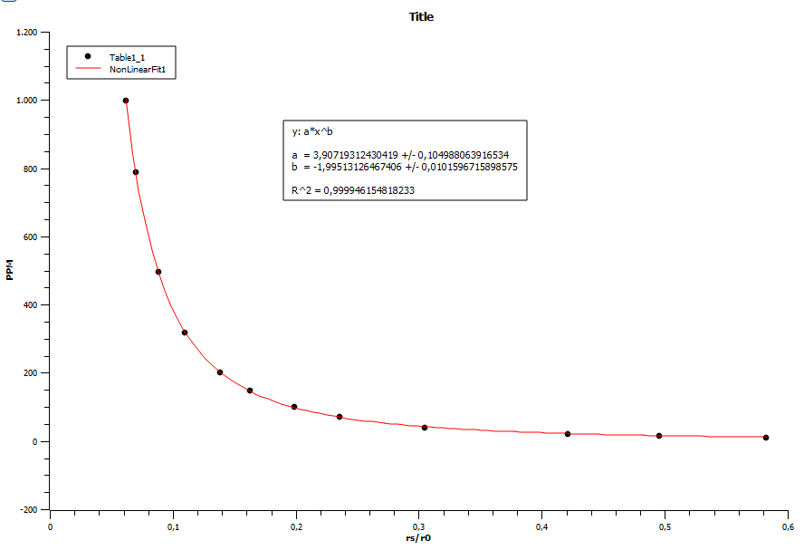

# MQSensor | ([PT_BR](./READMEptbr.md))
A library to simplify the use of any MQ sensor.  
Tested with MQ8 and MQ135 sensors.  

# How to install 
## Using Arduino IDE  
Open Arduino IDE, `Sketch > Include Library > Manage Libraries` and search for "`mqsensor`" by Daguer.  

## Manual Download  
Download the library in [release section](https://github.com/daguerpedro/MQSensor/releases).  
Open Arduino IDE, `Sketch > Include Library > Add .ZIP Library` and select the .zip.  
See the examples in Arduino IDE, `File > Examples > MQ Sensor`.  

# How to use  
**For each physical MQ-X sensor**, you must **create a new instance** of the 'MQ' class in the code and attach an analog port connected to the sensor.  
The following example is for an Mq135 sensor:  
- `AX` is the analog port.
- `RL` Is the value of the load resistor in kOhm attached to the MQ sensor (not shield's trimpot). 
- You must pass the 'resolution'(In Volt) and 'bits'(Positive Integer) parameters according to the analog-digital converter used. The converter can be the one in the Arduino itself, or an external one like the ADS115. To check the 'resolution' and 'bits' of your Arduino board go to https://www.arduino.cc/reference/en/language/functions/analog-io/analogread/. 
- **If you are using an Arduino Uno, it is not necessary to pass the 'resolution' and 'bits' parameters, the code will assume 5 and 10.**
```c++
MQSensor mq135(AX, RL, resolution, bits);
```
**It is important to use the 'calculateR0' function before trying to read 'ppm'**, the sensors base the **ppm** value on an **initial value 'R0'**, R0 is the initial sensor resistance.  
The calculateR0 function will calculate R0 using 'X' samples, save the R0 value in the instance and return the R0 value if you want to read it.
```c++
float R0 = mq135.calculateR0(int samples);
```

To read RS, Voltage or RS/R0 use:  
```c++
float v = mq135.readVoltage();
float rs = mq135.readRS();
float rsr0 = mq135.readRSR0();
float r0 = mq135.readSavedR0(); //This will return the same R0 value that is used to divide RS/R0
```
**To read a ppm you need to plot ppm(y) as a function of rs/r0(x) and create an exponential regression. Where y = a*x^b.**  
If you don't know how to do this, read the next chapter and see this [directory](./dados).
```c++
float ppm = mq135.readPPM(a, b);
```

### MQ8 


### MQ135

